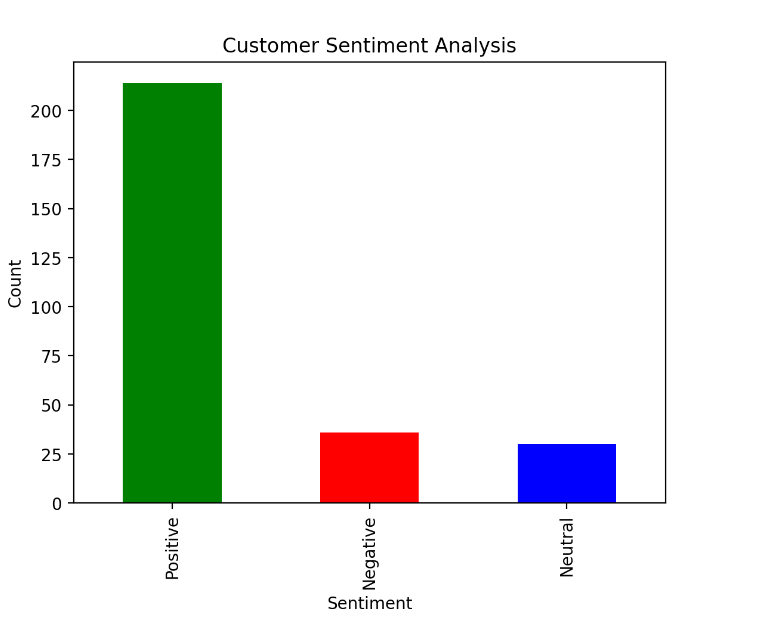
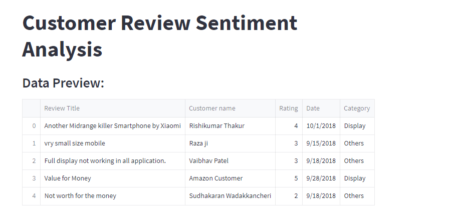

# 📊 Sentiment Analysis App  

A simple and interactive sentiment analysis web app built using **Streamlit, Pandas, and Matplotlib**.  
This app helps analyze customer reviews and provides sentiment insights in a visually appealing way.


## ✨ Features  

✔ Analyze pre-existing customer reviews from CSV files.  
✔ Upload your own dataset for sentiment analysis.  
✔ Classify sentiments as **Positive, Neutral, or Negative**.  
✔ Explore data with **interactive visualizations and filters**.  
✔ User-friendly interface powered by **Streamlit**.  


## 🖥️ Demo Screenshot  




## ⚡ Getting Started  

### 1️⃣ Clone the Repository  

```bash
git clone https://github.com/Hemalytica/sentiment-analysis.git
cd sentiment-analysis

2️⃣ Set Up a Virtual Environment (Optional, but Recommended)

python -m venv venv
source venv/bin/activate  # On Windows: venv\Scripts\activate

3️⃣ Install Dependencies

pip install -r requirements.txt

4️⃣ Run the Application

streamlit run app.py

App will now open in your web browser! 🚀

📂 Project Structure

📦 sentiment-analysis
┣ 📜 app.py               # Main Streamlit app
┣ 📜 sentiment_app.py      # Sentiment analysis functions
┣ 📂 data/                # Sample CSV files
┣ 📜 requirements.txt      # Dependencies
┣ 📜 README.md            # Documentation

🚀 Future Enhancements

We have big plans for this project! Here’s what’s coming next:

✅ AI-powered sentiment analysis using machine learning models.
✅ More dynamic visualizations with interactive charts.
✅ Better dataset handling for larger CSV files.

📜 License
This project is open-source under the MIT License.
Check the LICENSE file for more details.

📌 Uploading to GitHub
After adding your README.md, push it to GitHub:

git add README.md
git commit -m "Added README file"
git push origin main
Now, your README will be live on your GitHub repository! 🎉

🛠️ Tech Stack
Frontend: Streamlit
Backend: Python
Libraries: Pandas, Matplotlib, NLTK (for NLP processing)
Dataset: Pre-existing CSV files & user-uploaded data
